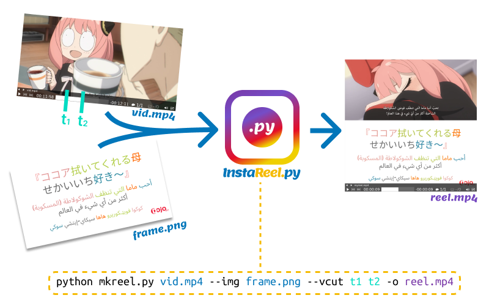

# instaReelPy
Generate Instagram reels from image frames and video cuts. 



## Install
```bash
git clone https://github.com/MossabDiae/instaReelPy.git
cd instaReelPy/instareelpy/

# install dependencies
pip install -r requirements.txt 
```

## Usage

* basic usage (preview only)
```
python mkreel.py input_video.mp4 --img input_img.png --vcut start_time end_time 
```

* time format:
  - The following time format can be used with the `--vcut` argument: `hh:mm:ss`, for e.g: `00:11:03`
  - You can safely omit hours if not needed: `11:03` 
  - Get more precise cuts: `11:03.5`, `00:11:03.7`, ...
  

* output to a file: `-o`
```
python mkreel.py input_video.mp4 --img input_img.png --vcut start_time end_time -o output_reel.mp4
```

* use `--auto-crop` to crop video so that it fits in available space
```
python mkreel.py input_video.mp4 --img input_img.png --vcut start_time end_time --auto-crop　-o output_reel.mp4
```

* use `--vcut` multiple times to make and concatenate multiple cuts from same input video
```
python mkreel.py input_video.mp4 --img input_img.png --vcut start_time end_time　--vcut start_time2 end_time2 -o output_reel.mp4
```

* when making multiple cuts a simple fade transition is inserted between them by default, you can disable this behavior by passing `--disable-transition`
```
python mkreel.py input_video.mp4 --img input_img.png --vcut start_time end_time　--vcut start_time2 end_time2 --disable-transition -o output_reel.mp4
```

* show help
```
python mkreel.py -h
```
